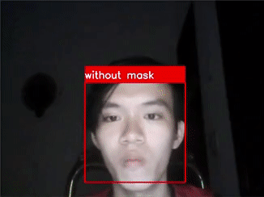
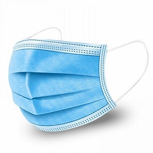
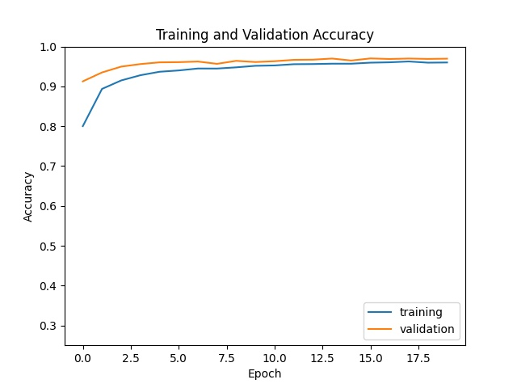
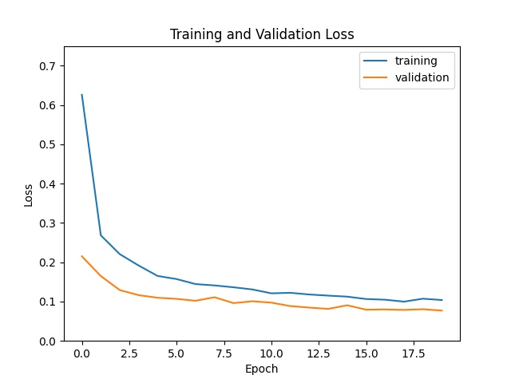
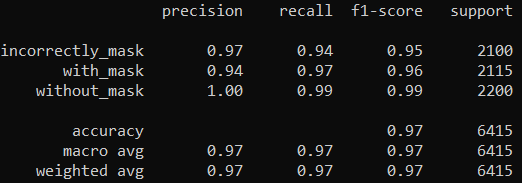

## Face-Mask Detection



### Prerequisites
* Python 3.6
* Tensorflow 2.5.0
* Keras 2.6.0

*Tested on Windows 10 64bit*

---
### Souce folder
* **data**: All preprocessed images (128x128) for training, validating and testing. You can download the original images following to the next section below.
* **face-mask-model.h5**: Trained model.
* **train.py**: Used for training and evaluating model.
* **test.py**: Used for running the program via webcam.

---
### Dataset
* The used dataset is aggregated from three datasets:
    * Correctly Masked Face Dataset ([CMFD](https://github.com/cabani/MaskedFace-Net))
    * Incorrectly Masked Face Dataset ([IMFD](https://github.com/cabani/MaskedFace-Net))
    * Flickr-Faces-HQ Dataset ([FFHQ](https://github.com/NVlabs/ffhq-dataset))
* There are 3 classes: [incorrectly-mask](https://esigelec-my.sharepoint.com/personal/cabani_esigelec_fr/_layouts/15/onedrive.aspx?id=%2Fpersonal%2Fcabani%5Fesigelec%5Ffr%2FDocuments%2FMaskedFaceNetDataset%2FIMFD&originalPath=aHR0cHM6Ly9lc2lnZWxlYy1teS5zaGFyZXBvaW50LmNvbS86ZjovZy9wZXJzb25hbC9jYWJhbmlfZXNpZ2VsZWNfZnIvRWlyalM4ZXc3LTVMbk84STU2VWs2M3dCS2Vid1NsdWtGQkZCYU84TjI1d24zZz9ydGltZT1NUThJd3JBbDJVZw), [with-mask](https://esigelec-my.sharepoint.com/personal/cabani_esigelec_fr/_layouts/15/onedrive.aspx?id=%2Fpersonal%2Fcabani%5Fesigelec%5Ffr%2FDocuments%2FMaskedFaceNetDataset%2FCMFD&originalPath=aHR0cHM6Ly9lc2lnZWxlYy1teS5zaGFyZXBvaW50LmNvbS86ZjovZy9wZXJzb25hbC9jYWJhbmlfZXNpZ2VsZWNfZnIvRXYzR2RuUVN5enhQanl6VTVFbEhxYWdCbGtSQ2FLbm5DSTg1aVgtZDFMNE9IQT9ydGltZT1faHo2MXJBbDJVZw) and [without-mask](https://drive.google.com/drive/folders/1tg-Ur7d4vk1T8Bn0pPpUSQPxlPGBlGfv)
* Download from **00000** folder to **11000** folder. If you want a larger dataset, download more.

---
### How to use
* Step 1: Preprocess the dataset if you download data manually. *Skip this step if using the attached dataset*.
    ```
    python preprocess.py
    ```
* Step 2: Train model. *Skip this step if using the attached model*.
    ```
    python train.py
    ```
* Step 3: Test model through your webcam.
    ```
    python test.py
    ```

* **Notice:** This model works best with the mask below.
<p align='middle'></p>

---
### Evaluation

<p align='middle'>
  
   
</p>
<p align='middle'></p>

---
### References
1. [Adrian Rosebrock (2020). COVID-19: Face Mask Detector with OpenCV, Keras/TensorFlow, and Deep Learning.](https://www.pyimagesearch.com/2020/05/04/covid-19-face-mask-detector-with-opencv-keras-tensorflow-and-deep-learning/)
2. [Hussain Mujtaba (2021). Real-time Face detection | Face Mask Detection using OpenCV.](https://www.mygreatlearning.com/blog/real-time-face-detection/)
3. [Ryan Akilos (2017). A simple example: Confusion Matrix with Keras flow_from_directory.py](https://gist.github.com/RyanAkilos/3808c17f79e77c4117de35aa68447045)
4. [Chandrika Deb. Face-Mask-Detection. Github.](https://github.com/chandrikadeb7/Face-Mask-Detection)
5. [Real-Time Face Mask Detector with Python, OpenCV, Keras.](https://data-flair.training/blogs/face-mask-detection-with-python/)